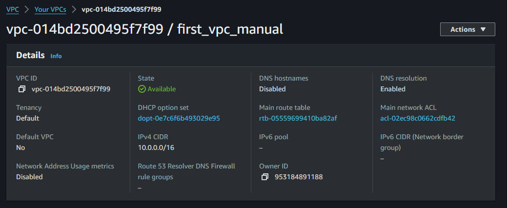
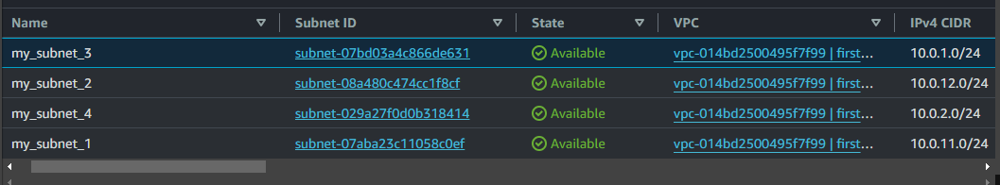
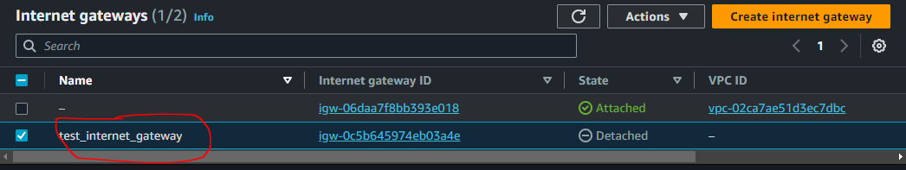
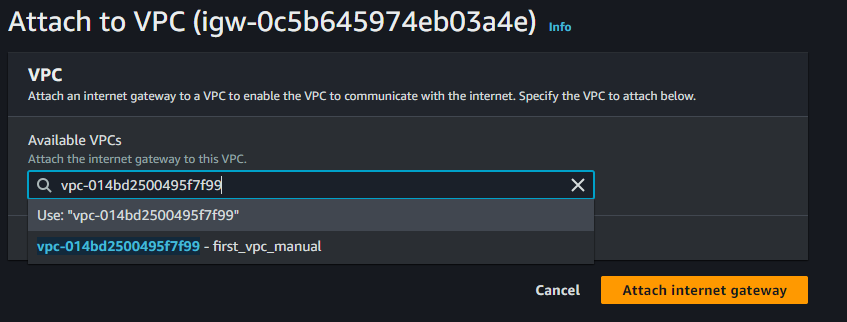
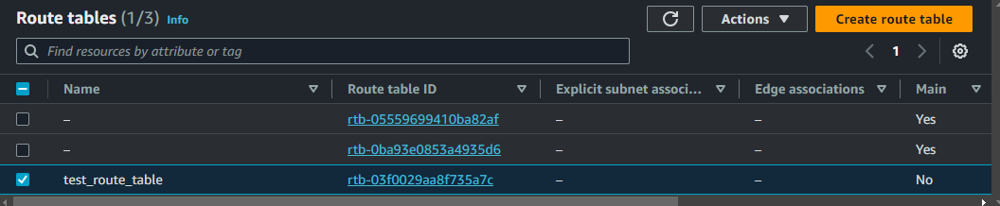
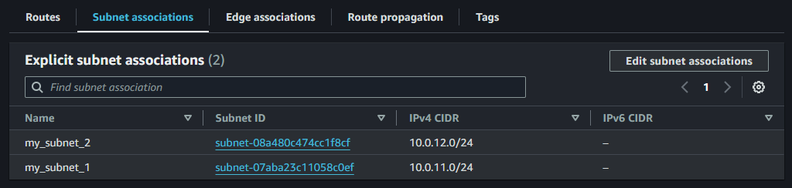
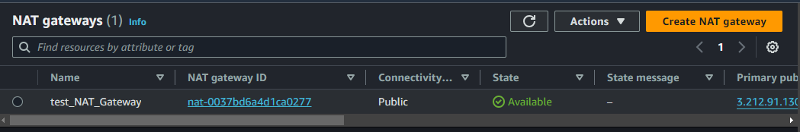
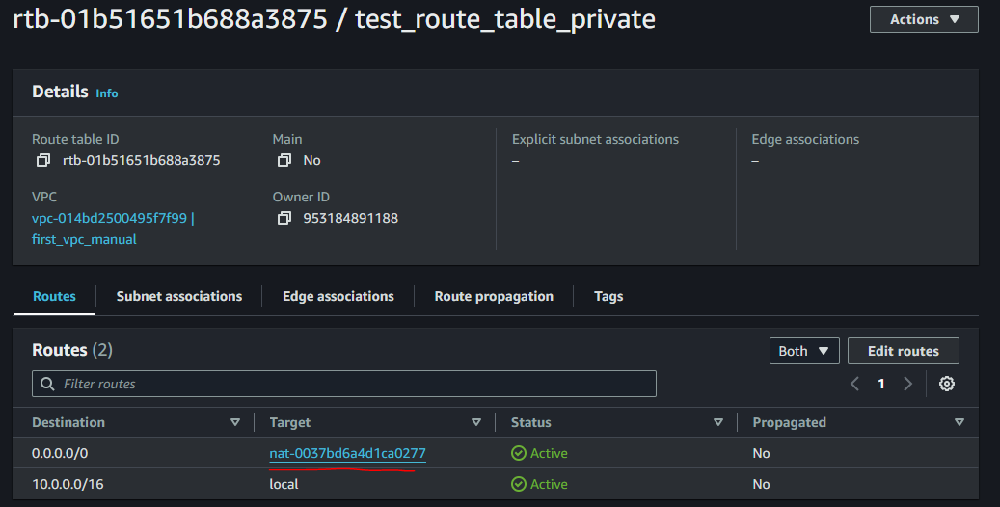
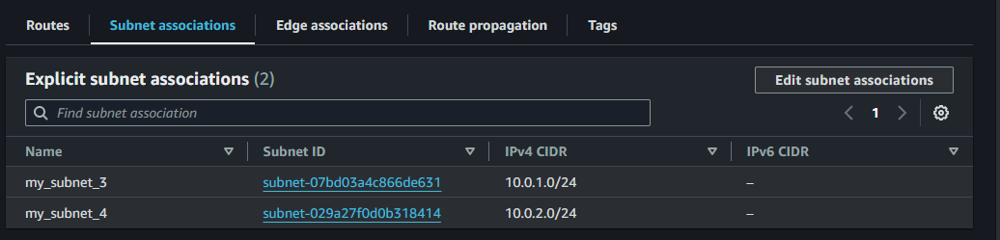
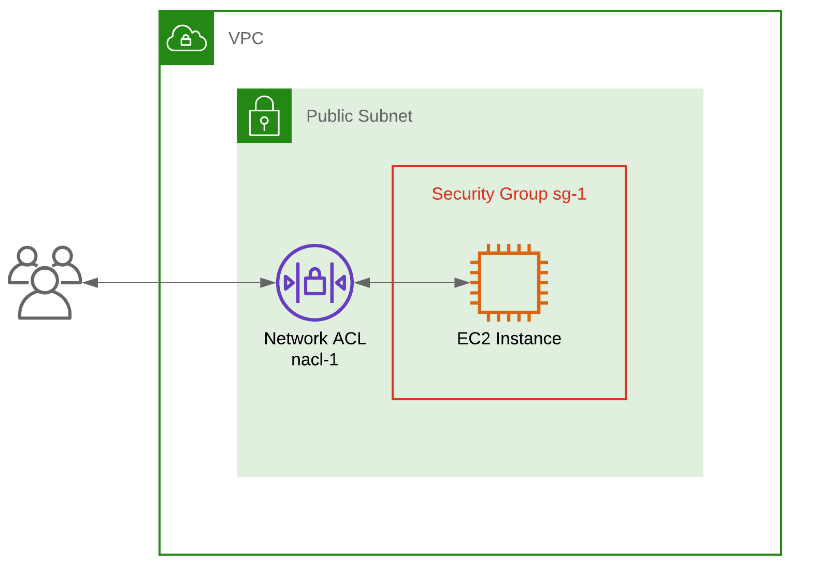

# AWS Network Implementation (VPC, Subnet, IG NAT, Routing)

AWS, meaning amazon web services, has its networking feature known as VPC, virtual private cloud.
Its like having your own private network under the amazon umbrella where you can place and manage
your resources like an EC2.

- The Default VPC
- Creating a new VPC
- Creating and configuring subnets

1. The default VPC: The default VPC is predefined in your environment by Amazon for your cloud
   resources. It has built in security and network settings to help get up and running quickly.

2. Creating a new VPC: n creating our VPC, we will choose the 'vpc only' option and use the CIDR
   10.0.0.0/16.

### creating and configuring subnets

Subnets helps break down a network into smaller segments within a VPC. It helps you organize and
manage your resources.

We have created 4 subnets, using the IPv4 CIDR 10.0.0.0/16 and CIDR block as shown below.

### Understanding Public and Private Subnet in AWS VPC

The subnet we created some do not have direct access to the internet (private subnet) while some do
(public subnet).

To Create a public subnet we go through the below steps

- Go to AWS VPC page
- Find subnet, click on it then click on create subnet
- Give the subnet a name, select the VPC
- Attach an internet gateway to this subnet to provide the internet access
- Update the route table associated with this subnet to allow traffic to flow to and from the
  internet.

To Create a private subnet we go through the below steps

- Go to AWS VPC page
- Find subnet, click on it then click on create subnet
- Give the subnet a name, select the VPC
- Do not attach an internet gateway to this subnet to provide the internet access
- The route table do not allow direct traffic to and from the internet.

So public subnet has gateway and route table, private subnet do not.

### Internet Gateway and Routing Table

Internet gateway gives internet access to our subnet. To connect our subnet to the internet we do
the below.

- An Internet Gateway attached to the VPC
- Routing table with default route towards the IGW
- Public IP assigned to the AWS resources

We have created our internet gateway, next we attache it to our VPC.

We want the private subnets to be private, and the public subnet to be public, to do this we will
create a separate route table for the public subnets.

### Routing Table

A routing table is like a map that tells data which way to go to reach its destination. So with the
route table we can decide which subnet routes to the internet and which subnet don't.

Lets create and configure a route table...

After creating a route table we need to add a default route to the internet gateway.

Then we edit and add associated subnet.

Now the VPC is ready and we can now add our resources in public subnet if they need internet access
or in private subnet if they do not.

NOTE: The route table created is for the public subnets, we have to create a route table for private
subnet too.

### NAT Gateway and Private Subnets

NAT: Network Address Translation acts like a secure door that only opens one way. It allows
resources inside the private subnet to access the internet for things like update and download, but
it does not allow anything from the internet to enter our private subnet.

Lets create a NAT Gateway and link it to a private subnet.

We will create a NAT Gateway and link it to our private subnet. we will also configure a route in
our routing table to direct internet traffic from your private subnet to the NAT Gateway

After the NAT Gateway has been created and an Elastic IP attached to it, we need to create a route
table for the private subnet, edit the route table, add a default route to the NAT Gateway.

Next we go to the subnet association and click on edit subnet association.

## Security Group and Network ACLs

Lets understand the difference between ACL (Access Control List) and Security Group.

A security group act as the front man that controls the flow of traffic to and from our resources in
a cloud environment. It determines the IP and port of incoming and out going network traffic. Its
act as a firewall that filters traffic based on predefined rules.

On the other hand, ACL or Network Access Control List is responsible for controlling inbound and out
bound traffic at the subnet level in a cloud computing environment.

It serves as a virtual barrier or perimeter security, defining rules that dictate which types of
traffic are permitted or denied. For example a network ACL can allow incoming SSH traffic on port 22
to specific subnet, while blocking all other types of incoming traffic.

Its important to know that network ACL operates at the subnet level, meaning they control traffic
for all instance within a subnet.

The security group and ACL are both important for securing your network on the AWS cloud, but they
serve different purpose and have different use case.

## VPC Peering and VPN Connection

VPC peering is a networking feature that allows you to connect two VPC (Virtual Private Cloud)
within the same cloud provider's network or across different regions.

